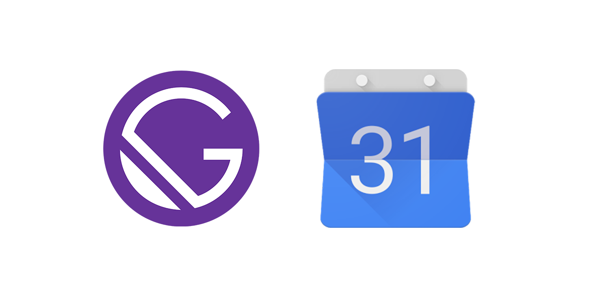

# gatsby-source-google-calendar

A Gatsby plugin to source events from a user's Google Calendars. 

## 🚀 Getting started

To get started using the plugin follow these steps:

### 1. Install plugin

```shell
npm install gatsby-source-google-calendar
```

### 2. Include the plugin in `gatsby-config.js`

```javascript
module.exports = {
  plugins: [
    // other gatsby plugins
    // ...
    {
      resolve: `gatsby-source-google-calendar`,
      options: {
        calendarIds: [
          'abc...1234@group.calendar.google.com',
        ],
        // options to retrieve the next 10 upcoming events
        timeMin: (new Date()).toISOString(),
        maxResults: 10,
        singleEvents: true,
        orderBy: 'startTime',
      }
    },
  ],
}
```

All options are optional. 
Specify the IDs of all the calendars you wish to query in the array `calendarIds`.
If you omit this field, it will query all calendars of the authenticated Google user.
You can further specify fields to filter the events of the calendars 
(e.g. minimum start/maximum end date, number of returned results, etc.).
A full list of options can be found [here](https://developers.google.com/calendar/v3/reference/events/list).

### 3. Authorize with Google

Before you can access the Google Calendar API, you have to 
[authorize your site with Google](https://developers.google.com/identity/protocols/oauth2/web-server).

#### Enable Google Calendar API for your project
To enable an API for your project:

1. [Open the API Library](https://console.developers.google.com/apis/library) in the Google API Console.
2. If prompted, select a project, or create a new one.
3. The API Library lists all available APIs, grouped by product family and popularity. If the API you want to enable isn't visible in the list, use search to find it, or click View All in the product family it belongs to.
4. Select the API you want to enable, then click the Enable button.
5. If prompted, enable billing.
6. If prompted, read and accept the API's Terms of Service.

#### Create authorization credentials
1. Go to the [Credentials page](https://console.developers.google.com/apis/credentials).
2. Click **Create credentials > OAuth client ID**.
3. Select the **Web application** application type.
4. Fill in the form and click **Create**. 
When prompted for a redirect URI, type in **ht<span>tp://</span>localhost:8000/oAuthCallback**.
The redirect URI is the endpoint to which the OAuth 2.0 server can send responses.
It is setup by the plugin automatically.
5. Store the resulting client configuration (Client ID and Client Secret) in your .env files in the 
root directory of your project:

```text
GOOGLE_CLIENT_ID=111122223333-123abcdef34567ghijklmnop.apps.googleusercontent.com
GOOGLE_CLIENT_SECRET=123ABC_987xyz
```

#### Retrieve API tokens
Once you've stored the client credentials, execute `gatsby develop`. 
When first executed, the plugin throws the following error:

```text
"gatsby-source-google-calendar" threw an error while running the sourceNodes lifecycle:

    Authorize this app by visiting this url:

https://accounts.google.com/o/oauth2/v2/auth?access_type=offline&scope=https%3A%2F%2Fwww.googleapis.com%2Fauth%2Fcalendar.readonly&response_type=code&client_id=111122223333-123abcdef34567ghijklmnop.apps.googleusercontent.com&redirect_uri=http%3A%2F%2Flocalhost%3A8000%2FoAuthCallback
```

Visit the displayed URL and follow the steps to complete the authorization.
On successful authorization, the plugin prints out the access and refresh tokens to the console:

```text
Successfully authorized app for Google Calendar API.
Store the following values in your .env files then restart gatsby develop:

GOOGLE_ACCESS_TOKEN=abc...123
GOOGLE_REFRESH_TOKEN=123...abc
```

Store these lines (e.g. the complete `FIELD=VALUE` lines without
newlines) in your `.env` files, then restart `gatsby develop`.
The plugin should now query the events from Google Calendar.

> **Important:** You should never expose API keys to your source control
> so you should not commit `.env` files to your source control 
> (make sure they are listed in `.gitignore`). 
> Services like Netlify provide a secure way to [include environment variables
> for your builds](https://www.netlify.com/docs/continuous-deployment/#build-environment-variables)).

### 4. Accessing calendars and events in your site
To access the sourced calendars and events in your site write a GraphQL query like this:
```graphql
query MyCalendarQuery {
  allCalendar {
    edges {
      node {
        summary
        description
        childrenCalendarEvent {
          summary
          start {
            date
            dateTime
          }
          description
          end {
            date
            dateTime
          }
        }
      }
    }
  }
}
```
This will return all calendars (with summary and description) with their 
respective events (`childrenCalendarEvent`).

The event schema generally follows [the event schema of the Google Calendar API](https://developers.google.com/calendar/v3/reference/events#resource).
However, the plugin adds an additional `allDay` flag indicating whether or not an event is marked as *all-day*.

Further, if an event is marked *all-day*, the plugin populates the event's `dateTime` field with the 
event's `date` field taking into account the calendar's timezone. 
This allows unified filtering of all kinds of events (*all-day* or not) in GraphQL queries.

Visit `http://localhost:8000/___graphql` to check out the created data and schema.

## Troubleshooting
### Plugin throws `Error: invalid_grant`
If the plugin throw an `invalid_grant` error it means that the provided Google refresh token is invalid.
While there may be [a number of causes for this](https://blog.timekit.io/google-oauth-invalid-grant-nightmare-and-how-to-fix-it-9f4efaf1da35#.eqa5iwbkt), here are some things you can try to resolve this issue:
1. Ensure that the token is correct, i.e. your `.env.*` files don't include any accidental line breaks.
2. Remove values for `GOOGLE_ACCESS_TOKEN` and `GOOGLE_REFRESH_TOKEN` and restart the authentication process.
3. [Revoke access to your Google Account for your app](https://support.google.com/accounts/answer/3466521?hl=en) and restart the authentication process. 
4. If above doesn't help, [set up a new OAuth2 client in the Google Console](https://github.com/msigwart/gatsby-source-google-calendar#create-authorization-credentials).

## How to contribute
Contributions are very welcome!
File a bug report or submit feature requests through the [issue tracker](https://github.com/msigwart/gatsby-source-google-calendar/issues). 
Of course, you can also just submit a pull request 😉

## Licence
This project is licensed under the [MIT License](LICENSE).
